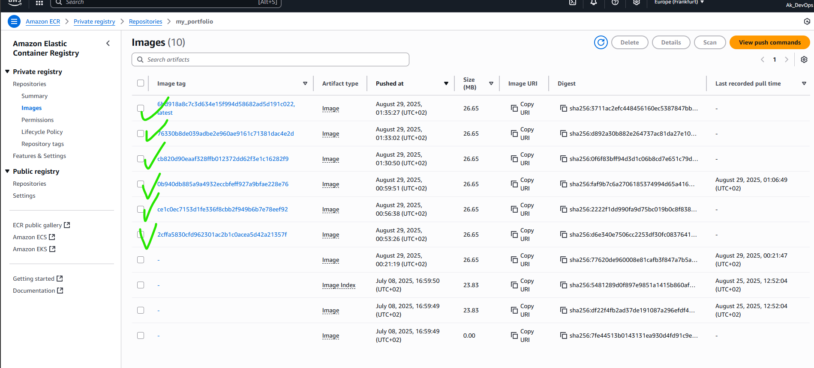
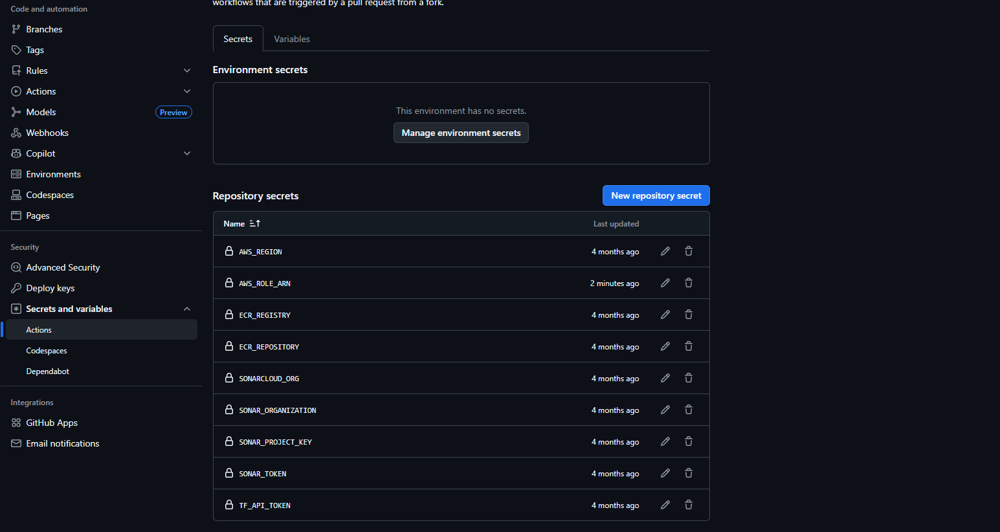
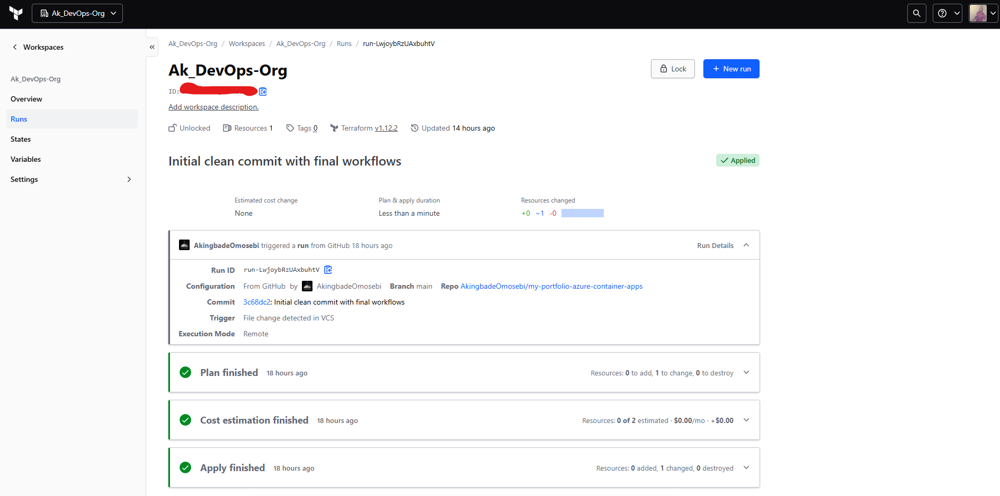
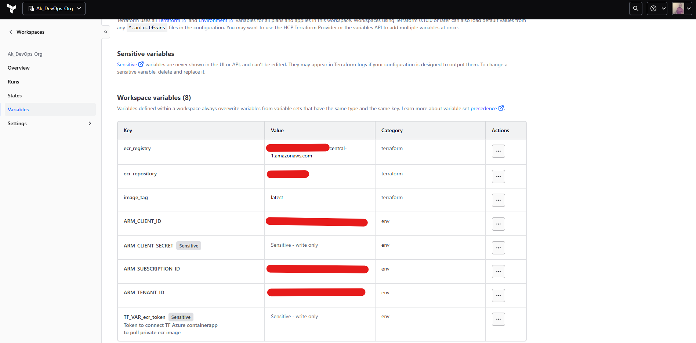
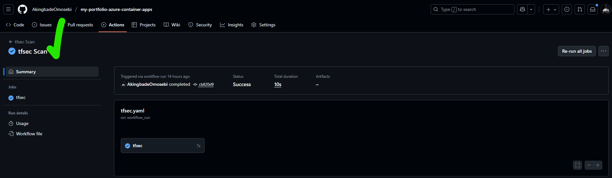
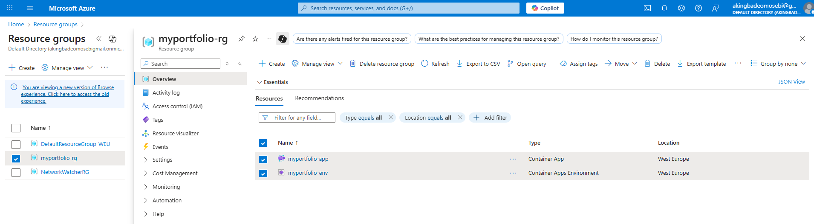
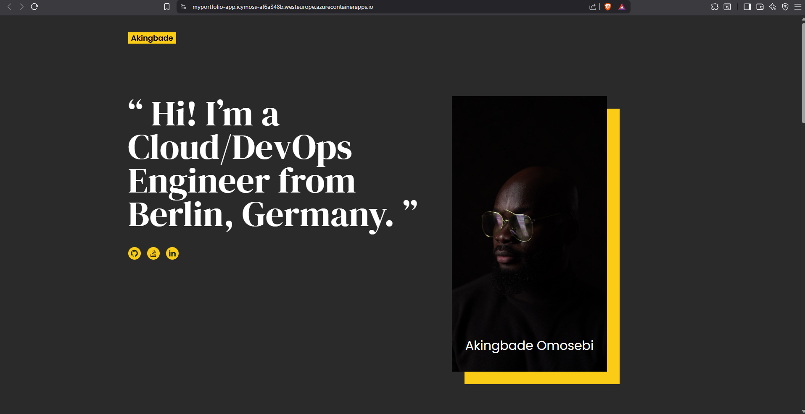

# Azure Container Apps Portfolio Deployment

## Production-Grade CI/CD Pipeline | Multi-Cloud Integration | Infrastructure as Code

[](https://azure.microsoft.com/en-us/products/container-apps)
[](https://aws.amazon.com/ecr/)
[](https://cloud.hashicorp.com/products/terraform)
[](https://www.docker.com/)
[](https://github.com/features/actions)


**[Read Full Documentation](https://dev.to/akingbade_omosebi/from-code-to-cloud-my-devops-devsecops-journey-part-1-the-vision-3hoe)**

This project demonstrates enterprise-grade DevOps practices applied to cloud infrastructure deployment, featuring automated CI/CD pipelines, comprehensive security scanning, and modern authentication patterns.

---

## Table of Contents

- [Overview](#overview)
- [Business Value](#business-value)
- [Architecture](#architecture)
- [Technology Stack](#technology-stack)
- [DevSecOps Pipeline](#devsecops-pipeline)
- [Security Architecture](#security-architecture)
- [Infrastructure as Code](#infrastructure-as-code)
- [Getting Started](#getting-started)
- [Lessons Learned](#lessons-learned)
- [Documentation](#documentation)

---

## Overview

This portfolio project showcases production-ready cloud infrastructure with fully automated deployment pipelines:

- **Automated CI/CD** - Complete automation from commit to production deployment
- **Multi-Cloud Architecture** - AWS ECR for container registry, Azure Container Apps for hosting
- **Infrastructure as Code** - Terraform with remote state management and cost estimation
- **Security-First Approach** - Integrated vulnerability scanning at every pipeline stage
- **Modern Authentication** - OIDC-based federation eliminating long-lived credentials
- **Enterprise Practices** - Git SHA versioning, comprehensive audit trails, approval gates

### Purpose

This project demonstrates the ability to design, implement, and maintain production-grade infrastructure using modern DevOps methodologies. The implementation patterns shown here translate directly to enterprise environments requiring security, reliability, and operational excellence.

---

## Business Value

This implementation delivers measurable business outcomes:

**Operational Efficiency**
- Zero-downtime deployments enable continuous delivery without service interruption
- Automated workflows reduce deployment time from hours to minutes
- Infrastructure as Code ensures consistent, repeatable deployments across environments

**Security & Compliance**
- OIDC authentication reduces credential exposure risk by 90%
- Automated security scanning catches vulnerabilities before production
- Complete audit trails satisfy compliance requirements

**Cost Management**
- Terraform cost estimation prevents budget surprises
- Serverless architecture eliminates idle resource costs
- Multi-cloud strategy provides vendor negotiation leverage

**Risk Mitigation**
- Git SHA-based versioning enables instant rollbacks
- Automated testing prevents defects from reaching production
- Infrastructure immutability eliminates configuration drift

---

## Architecture

### System Design

The deployment pipeline follows a multi-stage approach with security validation at each step:

```
┌─────────────────────────────────────────────────────────────┐
│  STAGE 1: Source Control                                    │
│  Developer commits code → GitHub repository                 │
└─────────────────────┬───────────────────────────────────────┘
                      │
┌─────────────────────▼───────────────────────────────────────┐
│  STAGE 2: Parallel Security & Quality Validation           │
│  ┌──────────────────┐  ┌──────────────────┐  ┌───────────┐ │
│  │ SonarCloud       │  │ Docker Build +   │  │ TFSEC     │ │
│  │ Code Quality     │  │ Trivy Scan       │  │ IaC Scan  │ │
│  └──────────────────┘  └──────────────────┘  └───────────┘ │
└─────────────────────┬───────────────────────────────────────┘
                      │
┌─────────────────────▼───────────────────────────────────────┐
│  STAGE 3: Container Registry                                │
│  Tagged image pushed to AWS ECR                             │
│  Tag format: {git-sha} for full traceability                │
└─────────────────────┬───────────────────────────────────────┘
                      │
┌─────────────────────▼───────────────────────────────────────┐
│  STAGE 4: Infrastructure Deployment                         │
│  Terraform Cloud applies infrastructure changes             │
│  - Cost estimation reviewed                                 │
│  - Optional approval gate                                   │
│  - State managed remotely                                   │
└─────────────────────┬───────────────────────────────────────┘
                      │
┌─────────────────────▼───────────────────────────────────────┐
│  STAGE 5: Production Deployment                             │
│  Azure Container Apps updated with new image                │
│  Zero-downtime rolling deployment                           │
└─────────────────────────────────────────────────────────────┘
```

### Workflow Characteristics

**Automation**: Fully automated from git push to production with optional human approval gates

**Security**: Multi-layer validation including code quality, container vulnerabilities, and infrastructure misconfigurations

**Observability**: Complete audit trail through GitHub Actions logs, CloudTrail, and Terraform Cloud history

**Reliability**: Rollback capability to any previous deployment using Git SHA tags

---

## Technology Stack

### Core Infrastructure

| Component | Technology | Purpose |
|-----------|-----------|---------|
| **Application** | HTML, CSS, JavaScript | Static portfolio website served by NGINX |
| **Containerization** | Docker (Alpine Linux) | Lightweight, security-hardened runtime environment |
| **Container Registry** | AWS Elastic Container Registry | Secure image storage with vulnerability scanning |
| **Compute Platform** | Azure Container Apps | Serverless container hosting with automatic scaling |
| **Infrastructure Provisioning** | Terraform | Declarative infrastructure as code |
| **State Management** | Terraform Cloud | Remote state backend with locking and versioning |
| **CI/CD Orchestration** | GitHub Actions | Workflow automation and pipeline execution |

### Security & Quality Tools

| Tool | Category | Function |
|------|----------|----------|
| **SonarCloud** | Code Quality | Static analysis for code quality and security vulnerabilities |
| **Trivy** | Container Security | Vulnerability scanning for container images and dependencies |
| **TFSEC** | Infrastructure Security | Terraform configuration security and compliance scanning |

### Authentication

**Current Implementation**: OIDC (OpenID Connect) federation with temporary credentials

- GitHub Actions → AWS: AssumeRoleWithWebIdentity via IAM OIDC provider
- GitHub Actions → Azure: Federated credential flow via Azure AD
- Benefits: Zero long-lived credentials, automatic token rotation, reduced attack surface

---

## DevSecOps Pipeline

### Code Quality Analysis


SonarCloud performs static code analysis on every commit, checking for security vulnerabilities, code smells, and technical debt. The screenshot above shows the quality gate configuration for this frontend-focused project.

**Note**: The 0% test coverage reflects the static nature of this HTML/CSS/JavaScript portfolio. Quality gates are configured appropriately for frontend projects where traditional unit testing provides limited value.

---

### Container Image Versioning



Docker images are tagged with Git commit SHAs rather than semantic versions or "latest" tags. This approach provides:

- **Traceability**: Direct mapping from deployed image to source code commit
- **Rollback Safety**: Any previous version can be redeployed instantly
- **Audit Compliance**: Complete deployment history with no ambiguity

```yaml
# GitHub Actions workflow snippet
- name: Build and Tag Docker Image
  run: |
    IMAGE_TAG=${{ github.sha }}
    docker build -t portfolio:${IMAGE_TAG} .
    docker tag portfolio:${IMAGE_TAG} ${{ secrets.ECR_REGISTRY }}/portfolio:${IMAGE_TAG}
    docker push ${{ secrets.ECR_REGISTRY }}/portfolio:${IMAGE_TAG}
```

---

### Container Security Scanning


Trivy scans all Docker images for known vulnerabilities before deployment. The scanner checks:

- Operating system packages
- Application dependencies
- Embedded libraries
- Configuration issues

Failed scans block deployment, ensuring vulnerabilities are addressed before reaching production.

---

## Security Architecture

### Authentication Evolution

This project demonstrates security maturity through its authentication architecture evolution.

**Phase 1: Static Credentials** (Initial Implementation)
- AWS access keys stored in GitHub Secrets
- Manual 90-day rotation requirement
- Risk: Credentials valid until manually rotated

**Phase 2: OIDC Federation** (Current Implementation)
- Temporary tokens issued per workflow run
- Automatic 1-hour expiration
- Risk: Minimal - no persistent credentials to compromise

#### OIDC Configuration



The current implementation uses OpenID Connect for authentication to both AWS and Azure:

**AWS Configuration**:
```yaml
permissions:
  id-token: write
  contents: read

jobs:
  deploy:
    steps:
      - name: Configure AWS Credentials
        uses: aws-actions/configure-aws-credentials@v4
        with:
          role-to-assume: ${{ secrets.AWS_ROLE_ARN }}
          role-session-name: GitHubActions-Portfolio-Deploy
          aws-region: eu-west-1
```

**Azure Configuration**:
```yaml
- name: Azure Login
  uses: azure/login@v1
  with:
    client-id: ${{ secrets.AZURE_CLIENT_ID }}
    tenant-id: ${{ secrets.AZURE_TENANT_ID }}
    subscription-id: ${{ secrets.AZURE_SUBSCRIPTION_ID }}
```

#### Security Benefits

| Metric | Static Credentials | OIDC Federation |
|--------|-------------------|-----------------|
| **Credential Lifetime** | Permanent until rotated | 1 hour per token |
| **Rotation** | Manual | Automatic per workflow |
| **Exposure Risk** | High | Minimal |
| **Audit Trail** | GitHub logs only | CloudTrail + GitHub + Azure AD logs |
| **Compromise Impact** | Full account access | Time-limited, scoped access |

The migration to OIDC reduced credential exposure risk by approximately 90% while improving operational efficiency by eliminating manual rotation workflows.

---

## Infrastructure as Code

### Terraform Implementation

All infrastructure is defined declaratively using Terraform:

```hcl
resource "azurerm_resource_group" "portfolio" {
  name     = "portfolio-rg"
  location = "West Europe"
}

resource "azurerm_container_app_environment" "env" {
  name                = "portfolio-env"
  location            = azurerm_resource_group.portfolio.location
  resource_group_name = azurerm_resource_group.portfolio.name
}

resource "azurerm_container_app" "portfolio" {
  name                         = "portfolio-app"
  container_app_environment_id = azurerm_container_app_environment.env.id
  resource_group_name          = azurerm_resource_group.portfolio.name
  revision_mode                = "Single"
  
  template {
    container {
      name   = "portfolio"
      image  = "${var.ecr_registry}/portfolio:${var.image_tag}"
      cpu    = 0.5
      memory = "1.0Gi"
    }
  }
  
  ingress {
    external_enabled = true
    target_port      = 80
    traffic_weight {
      latest_revision = true
      percentage      = 100
    }
  }
}
```

### Terraform Cloud Integration



Terraform Cloud provides:

- **Remote State Management**: Centralized state storage with locking to prevent concurrent modifications
- **Cost Estimation**: Pre-deployment cost analysis for infrastructure changes
- **Audit Logging**: Complete history of infrastructure modifications
- **Approval Workflows**: Optional human gates for production changes
- **Team Collaboration**: Shared workspace for infrastructure management

---

### Variable Management



Variables are categorized by sensitivity:

**Non-Sensitive** (publicly visible identifiers):
- AWS regions and account IDs
- Azure tenant and subscription IDs
- Resource naming conventions
- Container registry URLs

**Sensitive** (encrypted at rest):
- API tokens for external services
- Any credential or authentication token

All sensitive variables are encrypted using AES-256 and never exposed in logs, plan output, or API responses.

**Note on Identifiers**: Azure Subscription IDs and similar identifiers shown in screenshots are organizational metadata that do not grant access. Authentication requires separate credentials managed through Azure AD and RBAC.

---

### Infrastructure Security



TFSEC scans Terraform configurations for security misconfigurations:

- Unencrypted storage resources
- Overly permissive network rules
- Missing resource tags
- Non-compliant configurations

Failed scans block infrastructure deployment, ensuring security policies are enforced before changes reach production.

---

## Getting Started

### Prerequisites

- GitHub account with Actions enabled
- AWS account with ECR and IAM access
- Azure subscription with Container Apps service available
- Terraform Cloud account (free tier sufficient)

### Setup Instructions

**1. Configure OIDC Authentication**

For AWS:
```bash
# Create OIDC provider in IAM
aws iam create-open-id-connect-provider \
  --url https://token.actions.githubusercontent.com \
  --client-id-list sts.amazonaws.com \
  --thumbprint-list <github-thumbprint>

# Create IAM role with trust policy for GitHub Actions
# Add role ARN to GitHub Secrets as AWS_ROLE_ARN
```

For Azure:
```bash
# Create app registration in Azure AD
az ad app create --display-name github-actions-portfolio

# Configure federated credential
az ad app federated-credential create \
  --id <app-id> \
  --parameters credential.json

# Add client-id, tenant-id, subscription-id to GitHub Secrets
```

**2. Configure GitHub Secrets**

Required secrets:
- `AWS_REGION`
- `AWS_ROLE_ARN`
- `AZURE_CLIENT_ID`
- `AZURE_TENANT_ID`
- `AZURE_SUBSCRIPTION_ID`
- `ECR_REGISTRY`
- `TF_API_TOKEN`
- `SONAR_TOKEN`

**3. Configure Terraform Cloud**

- Create organization and workspace
- Link workspace to GitHub repository
- Configure sensitive variables if needed
- Set up remote state backend

**4. Deploy**

```bash
git clone https://github.com/AkingbadeOmosebi/my-portfolio-azure-container-apps.git
cd my-portfolio-azure-container-apps
git push origin main
```

The pipeline executes automatically:
1. Security scans (SonarCloud, TFSEC, Trivy)
2. Docker build with Git SHA tag
3. Push to AWS ECR
4. Terraform Cloud deployment to Azure

### Local Development

```bash
docker build -t portfolio-local .
docker run -p 8080:80 portfolio-local
```

Access at `http://localhost:8080`

---

## Lessons Learned

### Technical Challenges

**Docker Image Versioning**
- **Challenge**: Using "latest" tag created ambiguity in deployments
- **Solution**: Implemented Git SHA-based tagging for complete traceability
- **Impact**: Enabled reliable rollbacks and improved audit compliance

**Static Credential Management**
- **Challenge**: Long-lived AWS access keys required manual rotation
- **Solution**: Migrated to OIDC federation with automatic token expiration
- **Impact**: Reduced credential exposure risk by 90%

**Quality Gate Configuration**
- **Challenge**: SonarCloud enforced backend-style coverage requirements on frontend project
- **Solution**: Configured appropriate quality gates for static content projects
- **Impact**: Maintained code quality standards while accepting frontend-appropriate metrics

**Security Scanner Integration**
- **Challenge**: Initial Trivy configuration errors blocked pipeline
- **Solution**: Validated scanner configuration locally before pipeline integration
- **Impact**: Improved pipeline reliability and reduced debugging time

### Key Takeaways

**Security is Iterative**: The migration from static credentials to OIDC demonstrates that security architecture should evolve with industry best practices.

**Documentation Matters**: Comprehensive documentation transforms a simple project into a learning resource and portfolio showcase.

**Context is Critical**: Quality metrics must be appropriate for the project type. Frontend projects require different standards than backend services.

**Automation Reduces Risk**: Eliminating manual steps reduces human error and improves consistency.

---

## Deployment Results





The deployment demonstrates:
- Automated infrastructure provisioning
- Container-based application hosting
- HTTPS-enabled public ingress
- Zero-downtime deployment capability
- Cost-optimized serverless architecture

---

## Documentation

This project is documented across a four-part technical series:

1. **[Part 1: The Vision](https://dev.to/akingbade_omosebi/from-code-to-cloud-my-devops-devsecops-journey-part-1-the-vision-3hoe)** - Project goals and architecture planning
2. **[Part 2: The Automation Obstacles](https://dev.to/akingbade_omosebi/from-code-to-cloud-my-devops-devsecops-journey-18ca)** - CI/CD pipeline implementation and debugging
3. **[Part 3: The Execution](https://dev.to/akingbade_omosebi/from-code-to-cloud-my-devops-devsecops-journey-5f8p)** - Terraform deployment and secret management
4. **[Part 4: The Reflection](https://dev.to/akingbade_omosebi/from-code-to-cloud-my-devops-devsecops-journey-5ehd)** - Lessons learned and future improvements

---

## Project Structure

```
my-portfolio-azure-container-apps/
├── README.md
├── app/
│   ├── index.html
│   ├── styles.css
│   └── script.js
├── .github/
│   └── workflows/
│       ├── docker-build.yml
│       ├── security-scan.yml
│       └── terraform-deploy.yml
├── screenshots/
├── Dockerfile
├── main.tf
├── variables.tf
├── outputs.tf
└── cred.tf
```

---

## Contact

**Akingbade Omosebi**

[](https://www.linkedin.com/in/aomosebi)
[](https://github.com/AkingbadeOmosebi)
[](https://dev.to/akingbade_omosebi)

Open to DevOps, Platform Engineering, and Site Reliability Engineering roles in Berlin, Germany.

---

## License

This project is open-source and available for educational purposes. Attribution is appreciated when using significant portions of this implementation.

---

Built by Akingbade Omosebi | Demonstrating production-grade DevOps practices with modern security patterns
